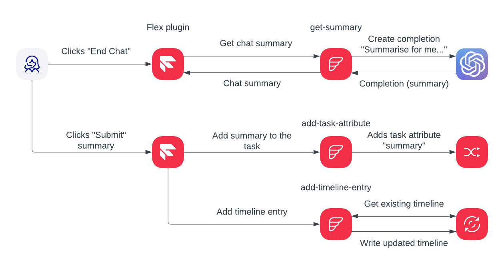
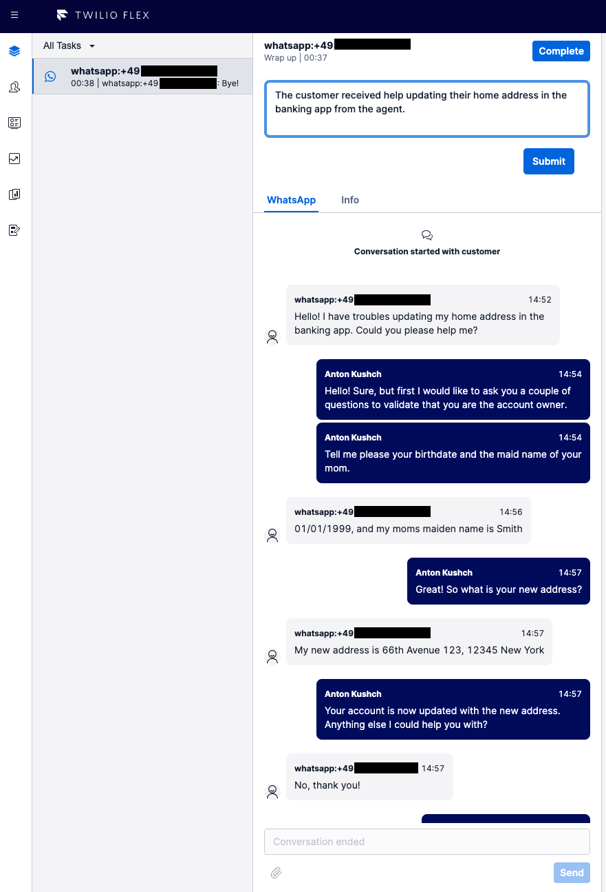
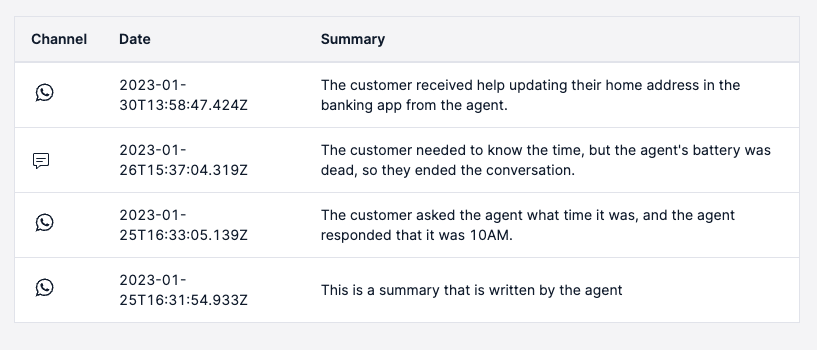

# Faster Wrap-up Times in Twilio Flex using a GPT-3 Chat Summary Plugin

This git repository contains code of a Twilio Flex Plugin that enables automating writing chat summary using OpenAI GPT-3 model.
The code is written in Typescript and has two modules:
- *flex* - the Flex plugin code
- *backend* - serverless functions powering the plugin

## Table of Content
- [Solution Description](#solution-description)
- [Architecture/Solution Diagram](#architecturesolution-diagram)
- [Business Value](#business-value)
- [Use Case & Industry](#use-case--industry)
- [Products Involved](#used-productsapis)
- [Demo Setup](#demo-setup)
- [Screenshots](#screenshots)
- [Demo Script](#demo-script)
- [Contributions](#contributions-)

# Solution Description

I'm sure it's happened to you – having to contact support multiple times with the same problem.
It is not a good customer experience, and it's even worse when you need to give context of the problem to a new agent, repeatedly.
Agents do not always have the context of your previous support calls, nor do they know the topic of those interactions.
Having that information would make the life of both the agent and the customer much easier: agents could serve customers much faster, and customers wouldn't need to repeat their issues.
That seems like a win/win situation!

Storing an interaction summary sounds great... *but who would write it?*

Luckily we can automate writing those summaries – and with the rise of AI, this task has become more straightforward than ever before.
The plugin in this repository adds to Twilio Flex a chat summary functionality powered by OpenAI's GPT-3 to generate a summary on demand.
The summary will be saved into interactions timeline in Twilio Sync and shown to agents on the next customer contact.

To learn more about developing plugins on your Flex instance, refer to the [getting started guide](https://www.twilio.com/docs/flex/quickstart/getting-started-plugin).

## Architecture/Solution Diagram

## Business Value

- **Improves customers experience** - agents have context of recent customer interactions, so customers does not have to repeat their issue, but also agents are able to help customers faster and to the point.
- **Improves agents experience** - agents does not have to write chat summaries, this tedious task is now automated.
- **Saves a lot of time** - writing chat summary is not only tedious, but also time-consuming, while AI can summarize even large conversations in matter of seconds.

## Use Case & Industry
- Applicable to all B2C industries
- Extensible to other channels such as voice (using call transcript)

## Used products/APIs

Twilio's products:

- It uses [Twilio Functions](https://www.twilio.com/docs/runtime/functions) to run the code to generate summary and update/get timeline
- It uses [Twilio Sync](https://www.twilio.com/sync) to store the timeline for each contact
- It uses the new [Twilio Paste](https://paste.twilio.design) - a UI library from Twilio which is the base for all future Flex Plugins

3rd party products / APIs:

- to generate the summary plugin uses [OpenAI GPT3 chat SDK](https://openai.com/api/).

## Demo Setup
### Prerequisites
- A **Twilio** account. You can sign up [here for free](https://twilio.com/try-twilio?_ga=2.142391154.1318561514.1676890516-932557877.1617012358).
- **Twilio Flex** account, navigate in your [Twilio Console](https://twilio.com/console?_ga=2.74299218.1318561514.1676890516-932557877.1617012358) to Flex, then Overview, then click the "Create My Flex Account" button.

    _Note: If you are using an existing Flex project make sure to enable [Flex UI 2.0](https://www.twilio.com/changelog/flex-ui-20-is-now-in-public-beta), the newest version of Flex!_

- You need to have the [Twilio CLI](https://www.twilio.com/docs/twilio-cli/quickstart). Type `twilio` in your terminal to see if you have it, if not, install it now. 
- You need the [Flex Plugins CLI](https://www.twilio.com/docs/flex/developer/plugins/cli/install) . Type `twilio plugins` to make sure you have it, if not, install it.
- **OpenAI** account and **OpenAI API key**. You can create one if you don't have here: https://beta.openai.com/account/api-keys

### Deployment

We have to deploy 2 assets:

- The Twilio Functions (backend module)
- The Flex Plugin (flex module)

#### To install the Twilio Functions:

1. clone this repo;
2. execute `cd ./backend` to go to the Twilio Functions folder.
3. `npm install` to install the packages into your computer.
4. rename `.env-example` from this folder to `.env` and follow the instructions in the `.env` file.
5. `npm run deploy` to deploy the functions to your Twilio environment.
6. Note the functions' domain in the output, you will need it to configure Plugin env.

#### To install the Flex Plugin:

1. execute `cd ../flex` to go to the Plugin folder root.
2. `npm install` to install the packages into your computer.
3. rename `.env-example` from this folder to `.env` and follow the instructions in the `.env` file.
4. You need to create a new profile for your Twilio CLI, type `twilio profiles:list` to check if you are using it correctly. If not, add a new profile with the cmd `twilio profiles:add`.
5. `npm run deploy -- --changelog "first deployment!"` to deploy this Plugin.
6. Once **step 7** is finished, it will show the next steps, you will have to run the command mentioned there (something like `twilio flex:plugins:release ... etc etc`)
7. We are done! Go to https://flex.twilio.com - Once chat is ended you should see a new component with generated summary. On the right side you will also see the Interactions Timeline for the contact.

## Screenshots
###Generated summary:

###Interactions timeline:

## Demo Script
1. Open Flex application and make sure your status is Available.
2. Write a "Hello!" SMS or WhatsApp message to a configured in Flex phone number.
3. Once the task pops up in Flex UI accept it.
4. Proceed with writing messages from agent and from customer until have a meaningful conversation. You can use the example [below](#conversation-example).
5. Click End Task button, the UI will show Summary Textarea and generated summary will appear in seconds. See the screenshot [here](#generated-summary).
6. Edit the summary text if needed and click Submit.
7. Complete the task.
8. Write a "Hello once again!" SMS or WhatsApp message to a configured in Flex phone number. 
(Ideally use a different channel if available, i.e. use WhatsApp if in the step number 2 you've used SMS or vice versa)
9. Once the task pops up in Flex UI accept it.
10. Show [the summary timeline](#interactions-timeline) on the rights side of the screen.

### Conversation example
**Customer**: Hello!\
**Agent**: Hello! Owl Bank customer support is here. My name is John, how can I help you?\
**Customer**: I have troubles updating my home address. Could you please help me?\
**Agent**: Sure, but first I would like to ask you a couple of security questions to validate that you are the account owner.\
**Agent**: What is your birth date? And what is your moms maid name?\
**Customer**: My birth date is 01/01/1999 and my moms maid name is Doe\
**Agent**: Great! So what is your new address?\
**Customer**: It is Hauptstraße 21, 12345, Berlin\
**Agent**: You account is up to date with the new address. Anything else I could help you with?\
**Customer**: Nope, thank you very much!

## Contributions ✨
Contributions of all kinds are welcome!

